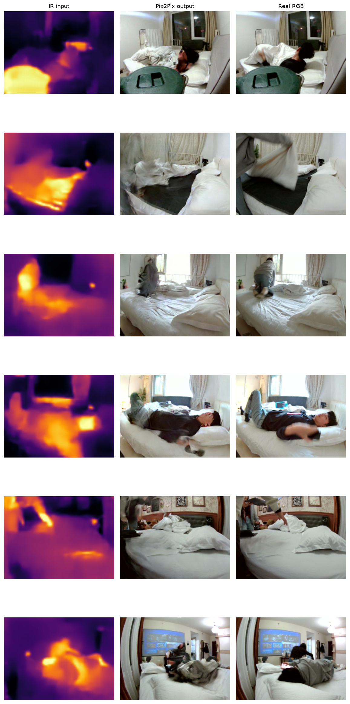
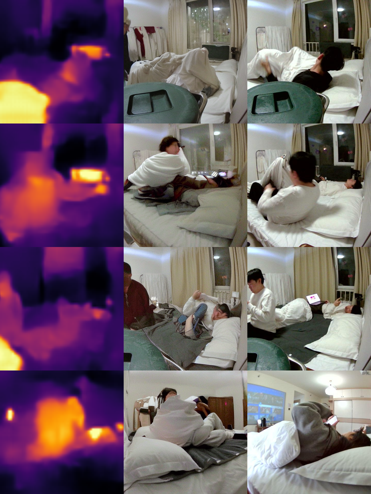
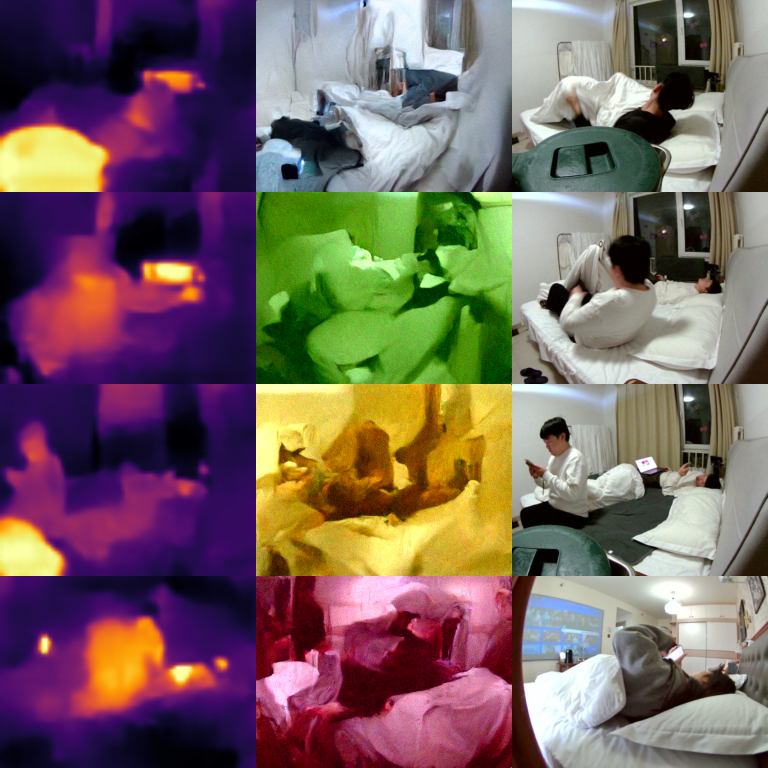

# IR2RGB — baseline benchmark

Generating the synchronized visible RGB image from the 80x62 thermal-infrared
pseudo-color image. All models are trained on the same room04-room12 pairs
(train 30,019 / test 7,505, random 80/20 split).

## Results so far

| Model | Family | PSNR ↑ | SSIM ↑ | LPIPS ↓ | Eval set |
|---|---|---:|---:|---:|---|
| Pix2Pix | GAN (regression) | 18.59 | 0.7001 | 0.1828 | 7,505 |
| ControlNet SD1.5 | pretrained diffusion | 10.54 | 0.367 | 0.7027 | 1,000 |
| Palette (simple DDPM) | diffusion from scratch | 7.85 | 0.1397 | 0.7635 | 500 |

Still running / not yet evaluated:

- SDXL ControlNet (trained, evaluating)
- NAFNet (training, epoch 27/100 at last check)

### Important note on diffusion models

ControlNet and Palette use an empty text prompt and generate a plausible RGB
that follows the infrared structure, not a pixel-aligned reconstruction of the
ground truth. PSNR / SSIM are therefore naturally much lower than for
regression models such as Pix2Pix. For these models, FID / distribution and
qualitative samples are the meaningful comparisons; FID will be added once the
remaining runs finish.

## Visualizations

Each image is a row of `IR input | generated RGB | real RGB`.

### Pix2Pix

### ControlNet SD1.5

### Palette (simple DDPM)

## Files

- `train.py` / `pix2pix.py` / `evaluate.py`: Pix2Pix pipeline.
- `train_controlnet_local.py` / `evaluate_controlnet.py`: SD1.5 ControlNet.
- `train_controlnet_sdxl_local.py` / `evaluate_controlnet_sdxl.py`: SDXL ControlNet.
- `train_palette.py` / `evaluate_palette.py`: Palette-style conditional DDPM.
- `train_nafnet.py`: NAFNet-style restoration network.
- `results/`: per-model metrics and sample images.
