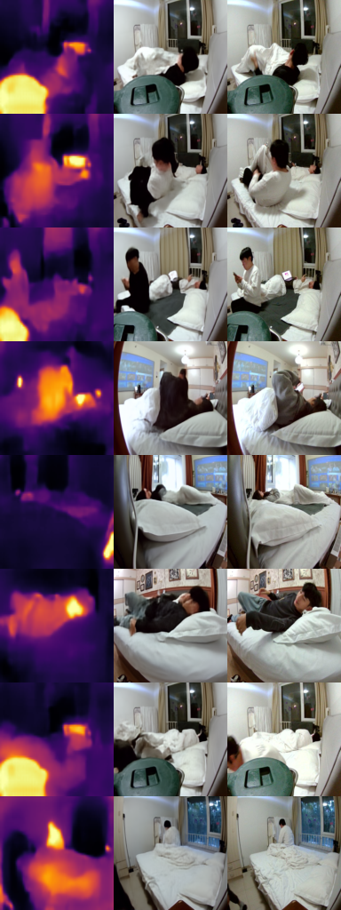

# IR2RGB — baseline benchmark

Generating the synchronized visible RGB image from the 80x62 thermal-infrared
pseudo-color image. All models are trained on the same room04-room12 pairs
(train 30,019 / test 7,505, random 80/20 split).

## Results

All metrics are on the held-out test split. Pix2Pix uses all 7,505 test
images; BBDM uses 7,434 test images; the other four models use the same
1,000-image subset.

| Model | PSNR ↑ | SSIM ↑ | MS-SSIM ↑ | MAE ↓ | RMSE ↓ | LPIPS ↓ | ΔE ↓ | FID ↓ | KID ↓ |
|---|---:|---:|---:|---:|---:|---:|---:|---:|---:|
| BBDM (epoch 90) | 19.47 | 0.7974 | 0.8014 | 0.0694 | 0.1329 | 0.1613 | 7.32 | 20.39 | 0.0113 |
| Pix2Pix | 18.59 | 0.7001 | 0.7847 | 0.0617 | 0.1179 | 0.1828 | 6.70 | 28.86 | 0.0159 |
| NAFNet (epoch 33) | 16.03 | 0.4369 | 0.5115 | 0.1104 | 0.1634 | 0.5401 | 10.96 | 265.59 | 0.2809 |
| SDXL ControlNet | 10.52 | 0.3983 | 0.1855 | 0.2374 | 0.3016 | 0.7011 | 22.83 | 68.79 | 0.0383 |
| ControlNet SD1.5 | 10.22 | 0.3334 | 0.2066 | 0.2517 | 0.3237 | 0.7375 | 24.22 | 78.28 | 0.0384 |
| Palette (simple DDPM) | 7.83 | 0.1371 | 0.1291 | 0.3374 | 0.4225 | 0.7609 | 36.21 | 229.05 | 0.2037 |

Machine-readable full metrics are in `results/summary_full.json` and
`results/<model>/metrics.json`.

NAFNet was stopped at epoch 33 after its training L1 plateaued (~0.22); the
number above is final.

BBDM (Brownian Bridge Diffusion Model, CVPR 2023) is evaluated from its
epoch-90 checkpoint (training was stopped early by a DDP/NCCL validation
timeout, not by convergence). Its input/output are 128x128; the metrics above
are computed after upscaling to 256x256, whereas Pix2Pix/NAFNet run at
192x256, so the numbers are not strictly resolution-matched.

### Important note on diffusion models

ControlNet and Palette use an empty text prompt and generate a plausible RGB
that follows the infrared structure, not a pixel-aligned reconstruction of the
ground truth. PSNR / SSIM are therefore naturally much lower than for
regression models such as Pix2Pix. For these models, FID / distribution and
qualitative samples are the meaningful comparisons.

BBDM is different from a plain DDPM: its Brownian-bridge reverse process starts
from the input IR image, so the generation remains grounded to the input. That
is why it reaches the highest PSNR / SSIM / LPIPS / FID / KID in this table.

### Known limitation

The input is only 80x62 pixels, so a person occupies a handful of pixels and a
face is a 2-4 pixel blob. Facial details cannot be recovered and generated
faces are therefore distorted or blurry; this is an inherent limitation of the
input resolution, not a model bug.

## Visualizations

Each image is a row of `IR input | generated RGB | real RGB`.

### BBDM (Brownian Bridge Diffusion Model)

### Pix2Pix

### NAFNet

### SDXL ControlNet

### ControlNet SD1.5

### Palette (simple DDPM)

## Files

- `train.py` / `pix2pix.py` / `evaluate.py`: Pix2Pix pipeline.
- `train_controlnet_local.py` / `evaluate_controlnet.py`: SD1.5 ControlNet.
- `train_controlnet_sdxl_local.py` / `evaluate_controlnet_sdxl.py`: SDXL ControlNet.
- `train_palette.py` / `evaluate_palette.py`: Palette-style conditional DDPM.
- `train_nafnet.py`: NAFNet-style restoration network.
- `third_party/bbdm` (external): BBDM training/sampling; see `RGB2T` sibling
  repo for the IR2RGB BBDM config.
- `results/`: per-model metrics and sample images.
