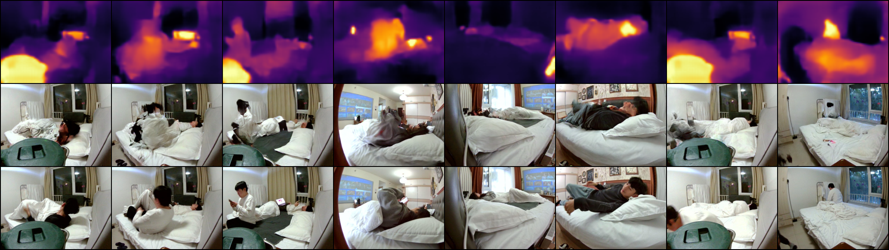

# IR2RGB — thermal-infrared to visible-RGB translation

This document describes the first baseline for generating the synchronized
visible RGB image from a low-resolution thermal-infrared pseudo-color image.

## 1. Task

Given an 80x62 thermal-infrared pseudo-color PNG, generate the corresponding
640x480 visible RGB frame from the on-device camera. The infrared and RGB
sensors are on the same device and are pixel-aligned, so this is a paired,
supervised image-to-image translation problem.

The mapping is inherently ill-posed: one thermal frame can correspond to many
plausible visible colors. Perceptual and distributional metrics (LPIPS, FID)
therefore matter as much as per-pixel metrics (PSNR, SSIM).

## 2. Data

- Scenes: `room04` ... `room12` (18 sessions).
- Only frames with `rgb.kind == device_cam` and `rgb.ok == true` are used.
- Total paired frames: **37,524**.
- Split: frame-level random 80 / 20 with seed 42.
  - train: **30,019**
  - test: **7,505**
- Manifest: `IR2RGB/data/train.csv` and `IR2RGB/data/test.csv`
  (regenerated by `prepare_dataset.py`).
- Training resolution: both modalities are resized to **256 x 192** (4:3),
  which preserves the 640x480 aspect ratio.

## 3. Model (Pix2Pix)

- Generator: U-Net with skip connections.
  - Input / output channels: 3 / 3.
  - Base filters `ngf = 64`.
  - Downsampling levels: 6.
  - Parameters: ~29.2 M.
- Discriminator: PatchGAN (70x70 receptive field).
  - Base filters `ndf = 64`, `n_layers = 3`.
  - Parameters: ~2.8 M.
- Weight initialization: conv / conv-transpose normal `N(0, 0.02)`;
  batch-norm weight 1.0, bias 0.0.

## 4. Training details

| Setting | Value |
|---|---|
| Loss | adversarial BCE + L1, weight `lambda_L1 = 100` |
| Optimizer | Adam, lr `2e-4`, betas `(0.5, 0.999)` |
| LR schedule | constant for epochs 1-50, then linear decay to 0 |
| Batch size | 32 |
| Epochs | 100 |
| Resolution | 256 x 192 |
| Input normalization | `[-1, 1]` |
| Augmentation | random horizontal flip (IR and RGB together), p=0.5 |
| GAN labels | real = 1, fake = 0 (BCEWithLogitsLoss) |
| Hardware | 1x NVIDIA H200 |
| Checkpoints | saved every 25 epochs plus final epoch 100 |

The generator L1 loss decreases from about **44** at epoch 1 to about **7.5**
at epoch 100. Per-epoch sample grids are saved every 5 epochs.

## 5. Evaluation protocol

All metrics are computed on the untouched test split (7,505 pairs).

- **PSNR**: mean squared error on `[0, 1]` 256x192 images.
- **SSIM**: `skimage.metrics.structural_similarity` on uint8 images,
  `data_range=255`, RGB (`channel_axis=2`), averaged over images.
- **LPIPS**: `lpips` AlexNet backbone.
- **FID**: InceptionV3 `pool3` features (2048-d), images resized to 299x299
  with ImageNet normalization; Frechet distance between real and generated
  feature distributions.

## 6. Results

| Metric | Value |
|---|---:|
| PSNR (dB) ↑ | 18.59 |
| SSIM ↑ | 0.7001 |
| LPIPS ↓ | 0.1828 |
| FID ↓ | 28.91 |

Interpretation: structure and layout are captured reasonably (SSIM 0.70,
LPIPS 0.18), while exact colors remain uncertain, which is expected for this
ill-posed thermal-to-visible mapping and keeps PSNR/FID modest.

Machine-readable metrics: `IR2RGB/results/metrics.json`.

## 7. Visualizations


The three columns are: infrared input, Pix2Pix output, and real RGB.



## 8. Reproduction

```bash
python -m venv .venv
.venv/bin/pip install torch torchvision pillow numpy matplotlib tqdm scipy lpips scikit-image

.venv/bin/python prepare_dataset.py
.venv/bin/python train.py --device cuda:4 --batch-size 32 --epochs 100 --workers 8
.venv/bin/python evaluate.py --device cuda:4 --batch-size 64 --workers 8
```

## 9. Files

- `prepare_dataset.py`: paired manifest and random 80/20 split.
- `pix2pix.py`: U-Net generator, PatchGAN discriminator, paired dataset.
- `train.py`: Pix2Pix training loop.
- `evaluate.py`: PSNR / SSIM / LPIPS / FID evaluation and sample generation.
