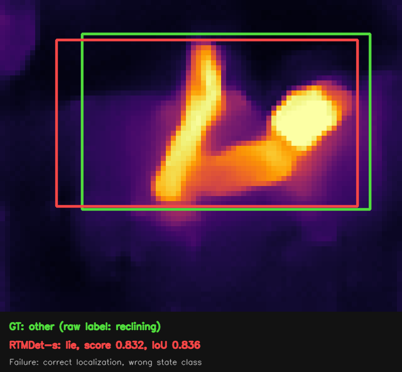
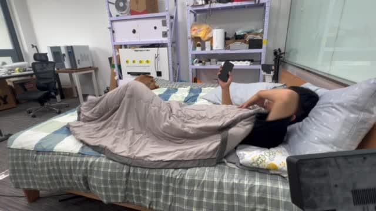
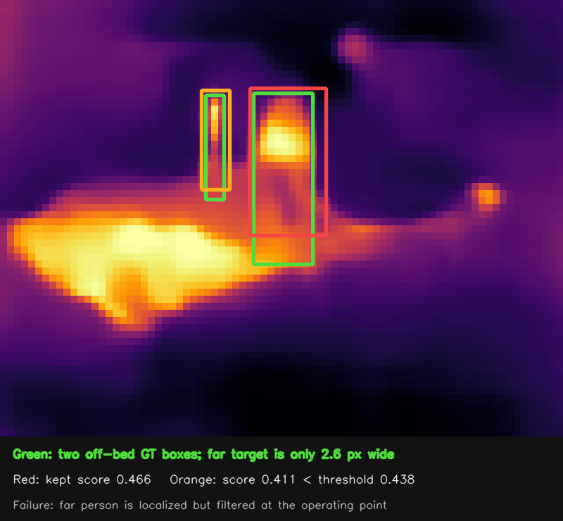
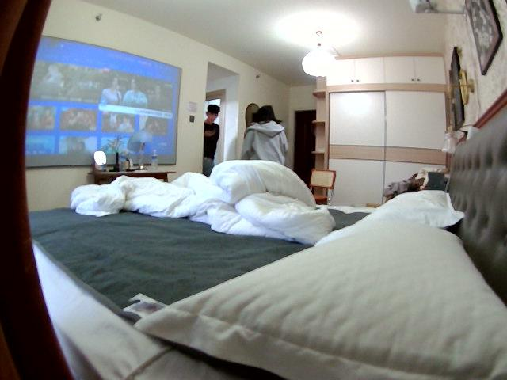
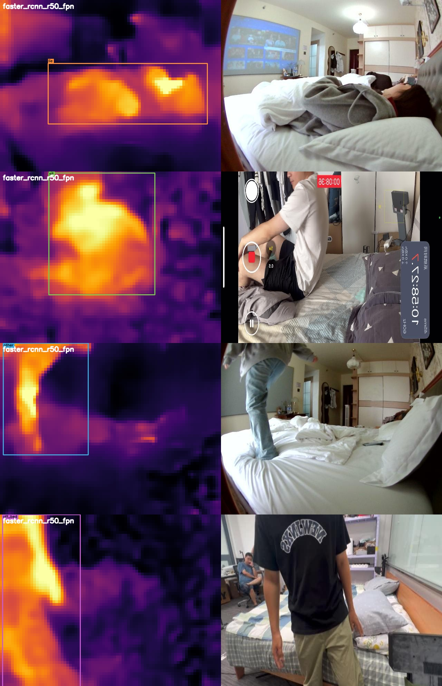
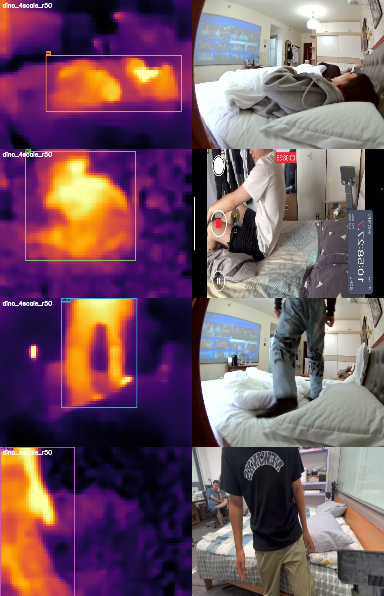

# MMDetection infrared person-state baselines

This report compares three MMDetection 3.3.0 detectors on the same
scene-disjoint, infrared-only person-state task used by the YOLO26s, YOLO11s,
and RT-DETR-L experiments in this repository.

RGB images are never used for training, validation, testing, or inference.
They appear only beside selected infrared predictions as visual references.

## Task and data split

Each detected person receives one of four states:

| Class | Meaning | Annotation rule |
|---|---|---|
| `lie` | 躺 | `posture_canon == lie` |
| `sit` | 坐 | `posture_canon == sit` |
| `other` | 其他行为 | Canonical `other`; 69 unmapped reclining boxes are folded in |
| `off_bed` | 床下/离床 | Explicitly annotated as `0_人在床下` |

The source annotations do not contain a reliable standing class. Frames with
a visible person but no usable state label are excluded rather than treated as
background or as an artificial `unknown` class.

Entire rooms are held out to prevent temporal and multi-view leakage:

| Split | Rooms | IR images | Boxes |
|---|---|---:|---:|
| Train | 01, 02, 04, 05, 06, 08, 09, 11, 12, 14, 15, 16, 17, 19 | 59,139 | 77,735 |
| Validation | 07, 13, 20 | 12,454 | 16,567 |
| Test | 03, 10, 18 | 12,237 | 16,657 |

The network input is a three-channel 80×62 infrared pseudo-color PNG,
resized and padded to 320×320. The three channels encode one thermal signal
through a color map; they are not images from the RGB camera.

## Models and training

All models start from their official COCO-pretrained checkpoints. The best
checkpoint is selected only by validation mAP50–95; the test rooms are not used
for model selection.

| Model | Schedule | GPUs | Batch/GPU | Total batch | Peak memory/GPU | Best epoch | Best Val mAP50–95 | Training time |
|---|---:|---:|---:|---:|---:|---:|---:|---:|
| RTMDet-s | 30 epochs | 2 | 128 | 256 | 17.1 GiB | 27 | **0.543** | 1 h 58 min |
| Faster R-CNN R50-FPN | 12 epochs | 2 | 64 | 128 | 14.3–15.6 GiB | 10 | 0.447 | 1 h 32 min |
| DINO 4-scale R50 | 12 epochs | 4 | 32 | 128 | 30.8 GiB | 6 | 0.466 | 2 h 05 min |

RTMDet uses Mosaic and MixUp for the first 25 epochs and switches to its
second-stage pipeline for the final five epochs. Faster R-CNN and DINO use
their standard 12-epoch R50 schedules adapted to 320×320 input.

## Held-out test results

Metrics below are computed once on rooms 03, 10, and 18 using the published
inference checkpoints in `mmdetection_results/*/weights/best.pth`.

Precision, Recall, and F1 are reported at IoU 0.5 using one confidence
threshold selected to maximize macro class F1. Every class uses the same
selected threshold.

| Model | Precision | Recall | F1 | mAP50–95 | mAP50 | mAP75 | AR@100 |
|---|---:|---:|---:|---:|---:|---:|---:|
| **RTMDet-s** | **0.823** | **0.762** | **0.791** | **0.546** | **0.830** | **0.593** | 0.737 |
| Faster R-CNN R50-FPN | 0.810 | 0.756 | 0.777 | 0.486 | 0.801 | 0.512 | 0.618 |
| DINO 4-scale R50 | 0.774 | 0.713 | 0.739 | 0.495 | 0.782 | 0.525 | **0.763** |

Complete per-class results:

| Model | Class | Precision | Recall | F1 | mAP50 | mAP50–95 |
|---|---|---:|---:|---:|---:|---:|
| RTMDet-s | `lie` | 0.918 | 0.838 | 0.876 | 0.920 | 0.582 |
|  | `sit` | 0.831 | 0.846 | 0.838 | 0.896 | 0.622 |
|  | `other` | 0.710 | 0.590 | 0.644 | 0.649 | 0.465 |
|  | `off_bed` | 0.833 | 0.776 | 0.804 | 0.854 | 0.514 |
| Faster R-CNN R50-FPN | `lie` | 0.894 | 0.856 | 0.875 | 0.898 | 0.525 |
|  | `sit` | 0.837 | 0.841 | 0.839 | 0.885 | 0.559 |
|  | `other` | 0.741 | 0.513 | 0.606 | 0.573 | 0.389 |
|  | `off_bed` | 0.767 | 0.812 | 0.789 | 0.847 | 0.469 |
| DINO 4-scale R50 | `lie` | 0.920 | 0.774 | 0.841 | 0.887 | 0.554 |
|  | `sit` | 0.794 | 0.809 | 0.801 | 0.863 | 0.569 |
|  | `other` | 0.533 | 0.589 | 0.559 | 0.554 | 0.402 |
|  | `off_bed` | 0.849 | 0.679 | 0.755 | 0.822 | 0.454 |

Comparison with the previously published Ultralytics models:

| Model | Framework | Test mAP50–95 | Delta vs YOLO26s |
|---|---|---:|---:|
| **RTMDet-s** | MMDetection | **0.546** | **+0.039** |
| YOLO26s | Ultralytics | 0.507 | — |
| YOLO11s | Ultralytics | 0.505 | -0.002 |
| RT-DETR-L | Ultralytics | 0.499 | -0.008 |
| DINO 4-scale R50 | MMDetection | 0.495 | -0.012 |
| Faster R-CNN R50-FPN | MMDetection | 0.486 | -0.021 |

RTMDet-s is the strongest tested model on this split. Its gain over YOLO26s
is 0.039 absolute mAP50–95, and it improves all four state classes. DINO has
the highest AR@100 but does not convert the additional detections into higher
precision. `other` remains the hardest class for every architecture.

Machine-readable results:

- [Combined summary](mmdetection_results/summary.json)
- [RTMDet-s metrics](mmdetection_results/rtmdet_s/metrics.json)
- [Faster R-CNN metrics](mmdetection_results/faster_rcnn_r50_fpn/metrics.json)
- [DINO metrics](mmdetection_results/dino_4scale_r50/metrics.json)

## Representative failure cases

The aggregate results do not imply that every test frame is solved. At the
published RTMDet-s operating point (`confidence=0.438`, `IoU=0.5`), `other` is
the weakest class: 538 true positives, 220 false positives, and 374 false
negatives, corresponding to 0.590 recall and 0.465 mAP50–95.

### Reclining `other` classified as `lie`

| Annotated infrared prediction | Paired RGB reference |
|---|---|
|  |  |

The raw annotation is `3_靠躺` (reclining), which this benchmark folds into
`other`. RTMDet-s localizes the person accurately (IoU 0.836) but predicts
`lie` with 0.832 confidence. Faster R-CNN and DINO make the same classification
error on this frame. This is a systematic ambiguity at the boundary between
the `lie` and `other` label definitions rather than a localization failure.
The RGB frame is a same-side phone-video reference captured 275 ms later; it
is provided for semantic interpretation and is not pixel-aligned with the IR.

### Tiny far person filtered by the operating threshold

| Annotated infrared prediction | Paired RGB reference |
|---|---|
|  |  |

This interference-condition frame contains two `off_bed` people. The near
person is retained at 0.466 confidence. The far person is only 2.6 pixels wide;
RTMDet-s localizes it at IoU 0.582, but its 0.411 confidence is below the 0.438
reporting threshold and is therefore counted as a false negative at this
operating point. Lowering the threshold recovers this instance but also raises
the risk of false detections from background heat sources. The RGB reference
comes from the same device 6 ms earlier and is pixel-aligned with the IR frame.

Exact frame identifiers, boxes, scores, IoUs, and the threshold decision are
stored in [failure-case metadata](mmdetection_results/rtmdet_s/failure_cases/metadata.json).

## Batch-one latency

The three MMDetection models are benchmarked sequentially on the same NVIDIA
L40S using their published checkpoints. Images are decoded and preloaded before
timing. Each result uses 100 warm-up frames followed by 1,000 frames × 3 runs,
strictly at batch size 1. The measurement includes the MMDetection ndarray
pipeline, network forward pass, and postprocessing, but excludes disk I/O.

| Model | Mean latency | Median | P95 | FPS |
|---|---:|---:|---:|---:|
| RTMDet-s | **11.964 ms** | 12.087 ms | 12.258 ms | **83.6** |
| Faster R-CNN R50-FPN | 12.875 ms | 12.711 ms | 12.985 ms | 77.7 |
| DINO 4-scale R50 | 24.271 ms | 24.112 ms | 24.299 ms | 41.2 |

The earlier Ultralytics benchmark used the same GPU, image size, batch size,
and preloaded test images. Its comparable pipeline measurements were 5.408 ms
for YOLO26s, 5.104 ms for YOLO11s, and 11.474 ms for RT-DETR-L. RTMDet-s is
therefore substantially more accurate than the small YOLO models, but roughly
twice as slow in the current PyTorch FP32 pipelines.

Benchmark JSON files:

- [RTMDet-s latency](mmdetection_results/rtmdet_s/benchmark.json)
- [Faster R-CNN latency](mmdetection_results/faster_rcnn_r50_fpn/benchmark.json)
- [DINO latency](mmdetection_results/dino_4scale_r50/benchmark.json)

## Test examples

Each row in the montages places the actual infrared prediction on the left and
its synchronized RGB reference on the right. Boxes and compact state labels are
drawn only on the infrared image. RGB remains outside the model pipeline.

### RTMDet-s


[Individual examples and timestamps](mmdetection_results/rtmdet_s/examples/)

### Faster R-CNN R50-FPN



[Individual examples and timestamps](mmdetection_results/faster_rcnn_r50_fpn/examples/)

### DINO 4-scale R50



[Individual examples and timestamps](mmdetection_results/dino_4scale_r50/examples/)

The original DINO `other` example was rejected because the model classified it
as `off_bed`. Its replacement is a held-out room10 frame with a correct
`other` prediction at 0.854 confidence, 0.954 IoU to the annotation, and a
pixel-aligned RGB frame 13 ms away.

## Included artifacts

Each model directory contains:

- `weights/best.pth`: inference-only FP16 storage checkpoint, loaded into
  standard FP32 MMDetection modules;
- `metrics.json`: held-out COCO metrics and per-class results;
- `benchmark.json`: strict batch-one latency statistics;
- `training/results.png` and `training/scalars.jsonl`: training loss and
  validation curves;
- `examples/`: four compact infrared predictions, paired RGB references,
  timestamps, alignment metadata, and raw detection JSONL.

The large raw COCO prediction files and temporary evaluation work directories
are intentionally excluded from Git. They can be regenerated with the commands
below.

## Reproduction

The recorded environment is Python 3.10, PyTorch 2.1.2+cu121, TorchVision
0.16.2, MMCV 2.1.0, MMEngine 0.10.7, and MMDetection 3.3.0. The local
MMDetection source checkout used commit `44ebd17b145c2372c4b700bfb9cb20dbd28ab64a`.

```bash
# From the IR-detect repository root.
git clone --branch v3.3.0 https://github.com/open-mmlab/mmdetection.git \
  third_party/mmdetection
python -m pip install -r requirements-mmdetection.txt

# Reuse the IR-only, scene-disjoint YOLO dataset and convert its labels to COCO.
python prepare_mmdetection.py \
  --yolo-root /path/to/dataset_v1/yolo26_ir/dataset \
  --output mmdetection_data
```

Training commands used for the reported runs:

```bash
PYTHONPATH=third_party/mmdetection CUDA_VISIBLE_DEVICES=0,1 \
python -m torch.distributed.launch --nproc_per_node=2 --master_port=29511 \
  third_party/mmdetection/tools/train.py \
  mmdetection_configs/rtmdet_s_ir.py --launcher pytorch

PYTHONPATH=third_party/mmdetection CUDA_VISIBLE_DEVICES=2,3 \
python -m torch.distributed.launch --nproc_per_node=2 --master_port=29512 \
  third_party/mmdetection/tools/train.py \
  mmdetection_configs/faster_rcnn_r50_fpn_ir.py --launcher pytorch

PYTHONPATH=third_party/mmdetection CUDA_VISIBLE_DEVICES=4,5,6,7 \
python -m torch.distributed.launch --nproc_per_node=4 --master_port=29513 \
  third_party/mmdetection/tools/train.py \
  mmdetection_configs/dino_4scale_r50_ir.py --launcher pytorch
```

Evaluate and benchmark a published checkpoint:

```bash
CUDA_VISIBLE_DEVICES=0 PYTHONPATH=third_party/mmdetection \
python evaluate_mmdetection.py \
  mmdetection_configs/rtmdet_s_ir.py \
  mmdetection_results/rtmdet_s/weights/best.pth \
  --output mmdetection_results/rtmdet_s/metrics.json --batch 128

CUDA_VISIBLE_DEVICES=0 PYTHONPATH=third_party/mmdetection \
python benchmark_mmdetection.py \
  mmdetection_configs/rtmdet_s_ir.py \
  mmdetection_results/rtmdet_s/weights/best.pth \
  --output mmdetection_results/rtmdet_s/benchmark.json \
  --frames 1000 --warmup 100 --repeats 3
```

## License note

Check the dataset and upstream framework/model licenses before commercial use.
