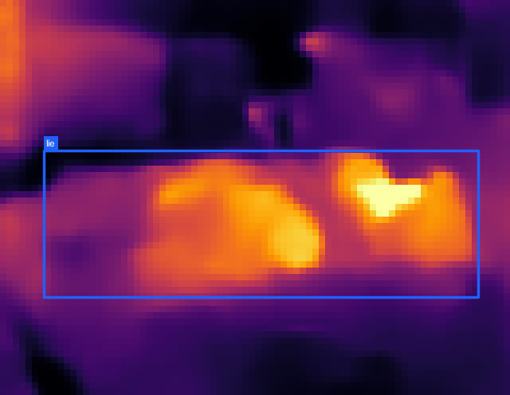
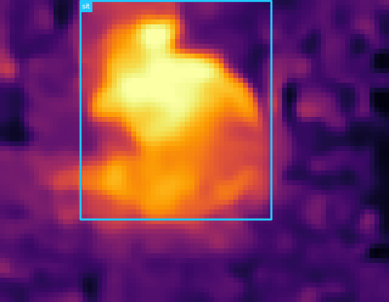
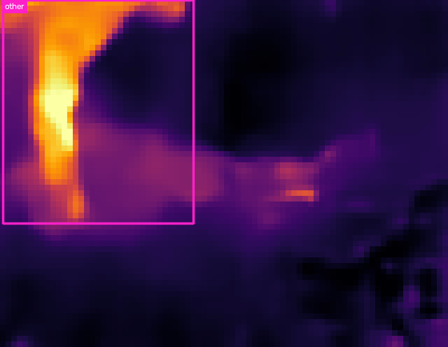
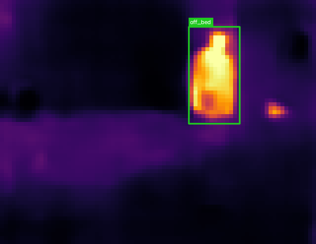
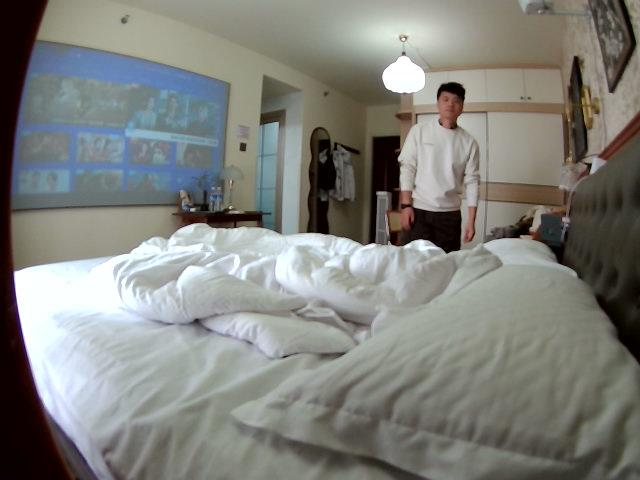

# RT-DETR-L infrared person-state detection

This is the standalone RT-DETR-L result for the `household_ir` dataset. The
detector takes only the 80×62 thermal-infrared pseudo-color PNG as input and
outputs a person bounding box plus one of four human states. RGB is never used
for training, validation, testing, or inference; paired RGB images below are
visual references only.

## Output states

| Class | Meaning | Annotation rule |
|---|---|---|
| `lie` | 躺 | `posture_canon == lie` |
| `sit` | 坐 | `posture_canon == sit` |
| `other` | 其他行为 | `other`; 69 unmapped reclining boxes are folded in |
| `off_bed` | 床下/离床 | explicitly annotated as `0_人在床下` |

The source data has no reliable standing annotation. Frames containing a
visible person whose state is missing are excluded instead of introducing an
`unknown` class.

## Scene-disjoint split

Entire rooms, rather than random frames, are held out to avoid temporal and
multi-view leakage.

| Split | Rooms | IR images | Boxes |
|---|---|---:|---:|
| Train | 01, 02, 04, 05, 06, 08, 09, 11, 12, 14, 15, 16, 17, 19 | 59,139 | 77,735 |
| Validation | 07, 13, 20 | 12,454 | 16,567 |
| Test | 03, 10, 18 | 12,237 | 16,657 |

## Model and training

- Model: `rtdetr-l.pt`, COCO pretrained
- Model size: 32.8M parameters, 109.9 GFLOPs before fusion
- Input: three-channel infrared pseudo-color PNG only, `imgsz=320`
- Maximum epochs: 100; patience: 20
- Actual training: stopped at epoch 30; best checkpoint: epoch 10
- Training time: 1.117 hours
- Batch size: **512 total** on 4× NVIDIA L40S (**128 per GPU**)
- Observed model-reported training memory: approximately 40.6 GB per GPU
- Optimizer: Ultralytics `auto` (selected MuSGD for this run)
- `deterministic=False`, as recommended for RT-DETR deformable attention on CUDA
- Moderate inverse-frequency class weighting: `cls_pw=0.25`
- Thermal-palette-safe augmentation: hue and saturation disabled
- Ultralytics version: 8.4.132; source commit: `b011d46a2ca107e911408a634d837982388f8f0d`

Best-checkpoint validation result: Precision 0.745, Recall 0.689, mAP50
0.750, and mAP50–95 0.506. The [training configuration](rtdetr/results/training/args.yaml),
[epoch log](rtdetr/results/training/results.csv), and
[training curves](rtdetr/results/training/results.png) are included.

## Held-out test results

These numbers were computed on the untouched test rooms 03, 10, and 18 using
the epoch-10 best checkpoint.

| Class | Precision | Recall | mAP50 | mAP50–95 |
|---|---:|---:|---:|---:|
| **Overall** | **0.790** | **0.721** | **0.775** | **0.499** |
| `lie` | 0.889 | 0.815 | 0.888 | 0.565 |
| `sit` | 0.767 | 0.860 | 0.840 | 0.578 |
| `other` | 0.631 | 0.552 | 0.586 | 0.416 |
| `off_bed` | 0.872 | 0.658 | 0.787 | 0.436 |

Artifacts:

- [Best RT-DETR-L checkpoint](rtdetr/weights/best.pt)
- [Machine-readable test metrics](rtdetr/results/metrics.json)
- [Normalized test confusion matrix](rtdetr/results/test_eval/confusion_matrix_normalized.png)
- [Test precision-recall curve](rtdetr/results/test_eval/BoxPR_curve.png)

## Test examples

The infrared prediction on the left is the actual model input and output. The
RGB image on the right is only a synchronized reference. Room10 pairs are
pixel-aligned; the room18 pair uses a separate phone viewpoint and is paired
semantically. Exact timestamps and offsets are in
[`rtdetr/examples/pairs.json`](rtdetr/examples/pairs.json), while raw detections
are in [`predictions.jsonl`](rtdetr/examples/predictions.jsonl).

| State | Infrared prediction (model input) | Paired RGB reference (not model input) |
|---|---|---|
| `lie` |  |  |
| `sit` |  |  |
| `other` |  |  |
| `off_bed` |  |  |

The examples use `conf=0.5`, thin 2-pixel boxes, and compact state-only labels.
Confidence scores remain available in the JSONL output.

## Reproduction

```bash
python -m venv .venv
.venv/bin/pip install -r requirements.txt

# dataset_v1 is the household_ir root; generated images are symlinks.
.venv/bin/python prepare_dataset.py --source /path/to/dataset_v1

# Four GPUs; batch 512 means 128 images per GPU.
.venv/bin/python train.py \
  --model rtdetr-l.pt --device 0,1,2,3 --batch 512 \
  --epochs 100 --imgsz 320 --name rtdetr_l_ir_status_b512 \
  --non-deterministic

# Evaluate only the held-out test rooms and keep artifacts separate.
.venv/bin/python evaluate.py \
  --model rtdetr/weights/best.pt \
  --output rtdetr/results/metrics.json \
  --project rtdetr/results --name test_eval --batch 128

# Infer from one infrared image or a directory recursively.
.venv/bin/python predict.py /path/to/ir \
  --model rtdetr/weights/best.pt --output rtdetr/predictions --conf 0.5
```

`predict.py` writes compact annotated images and `predictions.jsonl`. Each
detection contains `bbox_xyxy`, confidence, class id, English state, and Chinese
state.

## License note

Ultralytics is distributed under AGPL-3.0 with an enterprise-license option.
Check the upstream licensing terms before commercial deployment. The dataset is
not redistributed by this repository.
