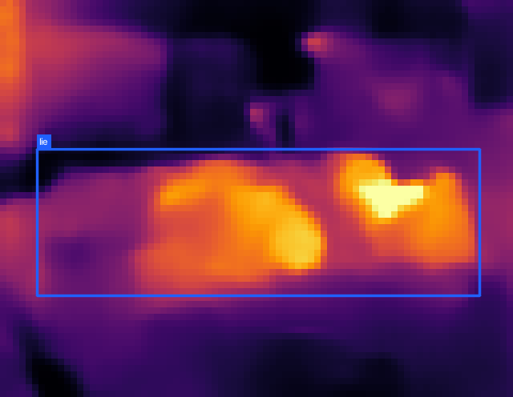
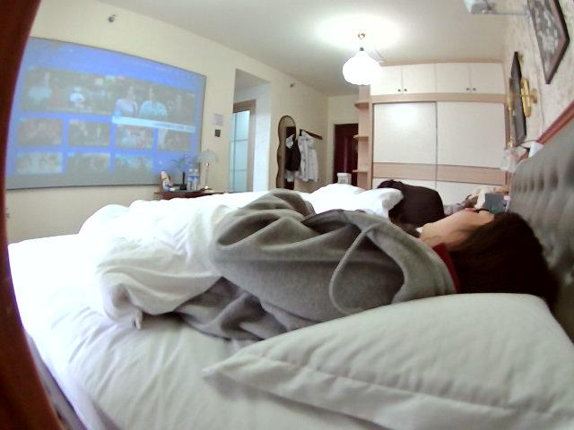
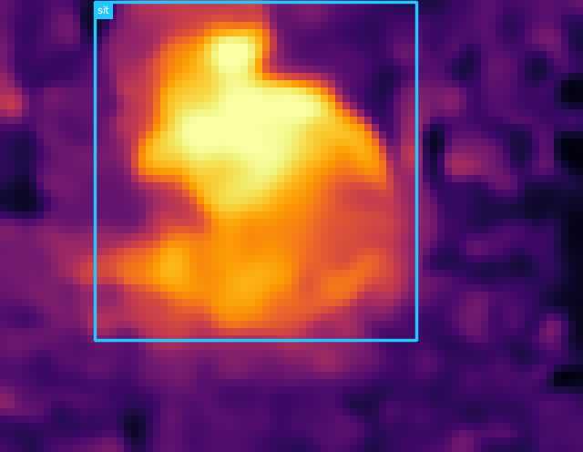
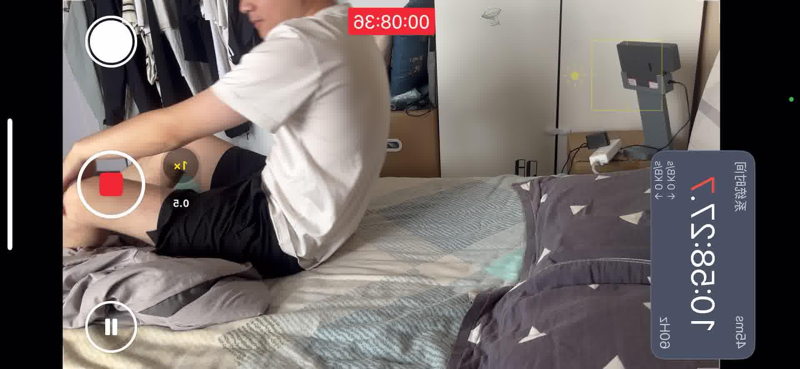
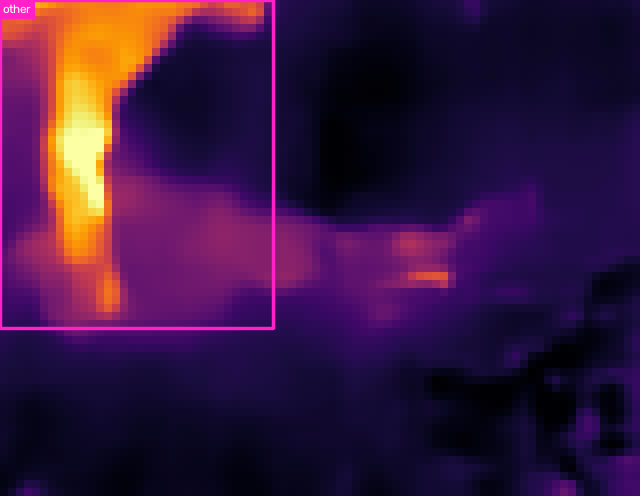
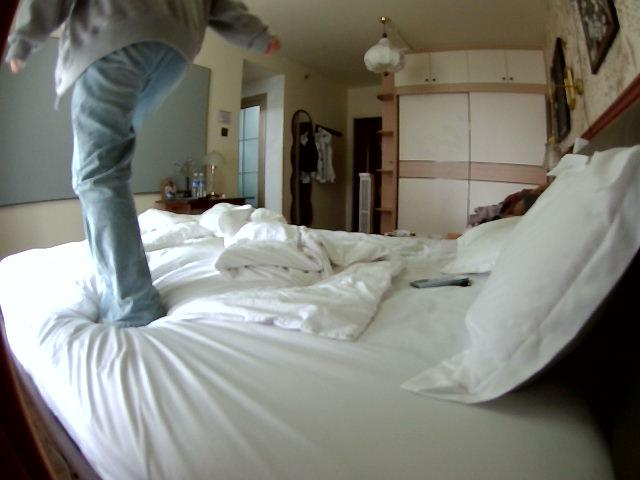
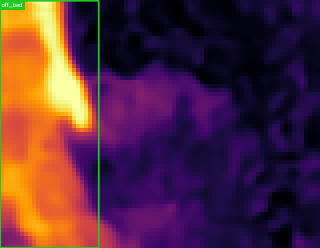
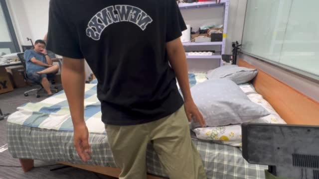

# YOLO11s infrared person-state detection

This is the standalone YOLO11s result for the `household_ir` dataset. In the
YOLO model family, the suffix `s` means **small**. The detector takes only the
80×62 thermal-infrared pseudo-color PNG as input and outputs a person bounding
box plus one of four human states. RGB is never used for training, validation,
testing, or inference; paired RGB images below are visual references only.

## Output states

| Class | Meaning | Annotation rule |
|---|---|---|
| `lie` | 躺 | `posture_canon == lie` |
| `sit` | 坐 | `posture_canon == sit` |
| `other` | 其他行为 | `other`; 69 unmapped reclining boxes are folded in |
| `off_bed` | 床下/离床 | explicitly annotated as `0_人在床下` |

There is no reliable standing annotation in the source data. Frames containing
a visible person whose state is missing are excluded instead of introducing an
`unknown` class.

## Scene-disjoint split

Entire rooms, rather than random frames, are held out. This avoids temporal and
multi-view leakage between the three splits.

| Split | Rooms | IR images | Boxes |
|---|---|---:|---:|
| Train | 01, 02, 04, 05, 06, 08, 09, 11, 12, 14, 15, 16, 17, 19 | 59,139 | 77,735 |
| Validation | 07, 13, 20 | 12,454 | 16,567 |
| Test | 03, 10, 18 | 12,237 | 16,657 |

## Model and training

- Model: `yolo11s.pt`, COCO pretrained (`s` = small)
- Model size: 9.43M parameters, 21.7 GFLOPs before fusion
- Input: infrared PNG only, `imgsz=320`
- Maximum epochs: 100; patience: 20
- Actual training: stopped at epoch 40; best checkpoint: epoch 20
- Batch size: **2048 total** on 4× NVIDIA L40S (**512 per GPU**)
- Observed training memory: approximately 28.9 GB per GPU
- Optimizer: Ultralytics `auto` (selected AdamW for this run)
- Moderate inverse-frequency class weighting: `cls_pw=0.25`
- Thermal-palette-safe augmentation: hue and saturation disabled
- Ultralytics version: 8.4.132; source commit: `b011d46a2ca107e911408a634d837982388f8f0d`

Best-checkpoint validation result: Precision 0.723, Recall 0.655, mAP50
0.711, and mAP50–95 0.468. The [training configuration](yolo11/results/training/args.yaml),
[epoch log](yolo11/results/training/results.csv), and
[training curves](yolo11/results/training/results.png) are included.

## Held-out test results

These numbers were computed once on the untouched test rooms 03, 10, and 18
using the epoch-20 best checkpoint.

| Class | Precision | Recall | mAP50 | mAP50–95 |
|---|---:|---:|---:|---:|
| **Overall** | **0.806** | **0.729** | **0.789** | **0.505** |
| `lie` | 0.894 | 0.831 | 0.899 | 0.540 |
| `sit` | 0.763 | 0.841 | 0.852 | 0.571 |
| `other` | 0.780 | 0.536 | 0.626 | 0.453 |
| `off_bed` | 0.788 | 0.707 | 0.780 | 0.458 |

Artifacts:

- [Best YOLO11s checkpoint](yolo11/weights/best.pt)
- [Machine-readable test metrics](yolo11/results/metrics.json)
- [Normalized test confusion matrix](yolo11/results/test_eval/confusion_matrix_normalized.png)
- [Test precision-recall curve](yolo11/results/test_eval/BoxPR_curve.png)

## Test examples

The infrared prediction on the left is the actual model input and output. The
RGB image on the right is only a synchronized reference. Room10 pairs are
pixel-aligned; room03 and room18 use a separate phone viewpoint and are paired
semantically. Exact timestamps and offsets are in
[`yolo11/examples/pairs.json`](yolo11/examples/pairs.json), while raw detections
are in [`predictions.jsonl`](yolo11/examples/predictions.jsonl).

| State | Infrared prediction (model input) | Paired RGB reference (not model input) |
|---|---|---|
| `lie` |  |  |
| `sit` |  |  |
| `other` |  |  |
| `off_bed` |  |  |

The examples use thin 2-pixel boxes and compact state-only labels. Confidence
scores remain available in the JSONL output.

## Reproduction

```bash
python -m venv .venv
.venv/bin/pip install -r requirements.txt

# dataset_v1 is the household_ir root; generated images are symlinks.
.venv/bin/python prepare_dataset.py --source /path/to/dataset_v1

# Four GPUs; batch 2048 means 512 images per GPU.
.venv/bin/python train.py \
  --model yolo11s.pt --device 0,1,2,3 --batch 2048 \
  --epochs 100 --imgsz 320 --name yolo11s_ir_status_b2048

# Evaluate only the held-out test rooms and keep artifacts in the YOLO11 area.
.venv/bin/python evaluate.py \
  --model yolo11/weights/best.pt \
  --output yolo11/results/metrics.json \
  --project yolo11/results --name test_eval --batch 512

# Infer from one infrared image or a directory recursively.
.venv/bin/python predict.py /path/to/ir \
  --model yolo11/weights/best.pt --output yolo11/predictions
```

`predict.py` writes compact annotated images and `predictions.jsonl`. Each
detection contains `bbox_xyxy`, confidence, class id, English state, and Chinese
state.

## License note

Ultralytics is distributed under AGPL-3.0 with an enterprise-license option.
Check the upstream licensing terms before commercial deployment. The dataset is
not redistributed by this repository.
