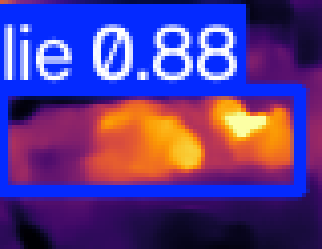
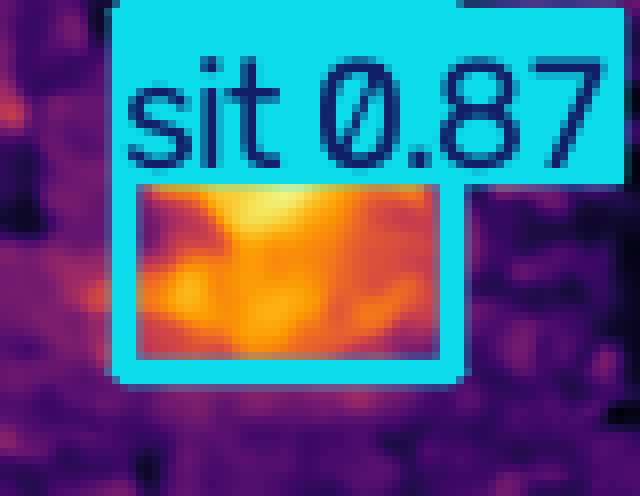
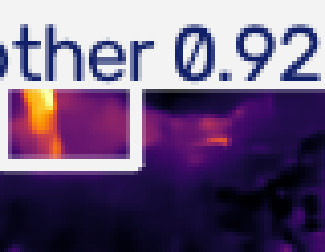
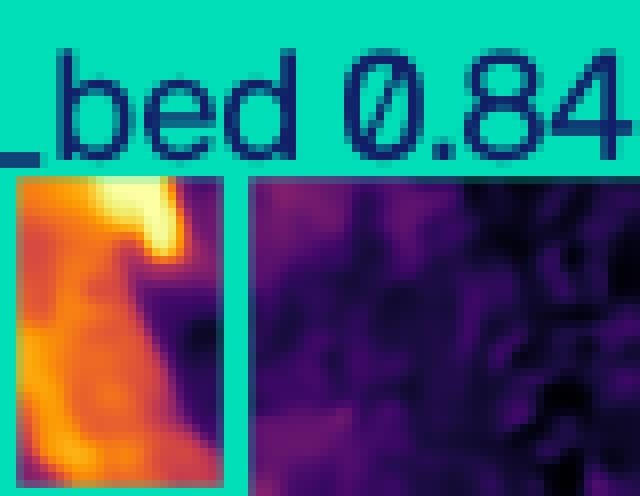

# IR-detect: YOLO26 infrared person-state detection

YOLO26s person detection and state recognition for the `household_ir` dataset.
The model uses **only 80×62 thermal-infrared pseudo-color PNGs**. RGB images
are never included in the generated train/validation/test manifests.

## Output states

| Class | Meaning | Source annotation rule |
|---|---|---|
| `lie` | 躺 | `posture_canon == lie` |
| `sit` | 坐 | `posture_canon == sit` |
| `other` | 其他行为 | `other`; the 69 unmapped reclining boxes are folded in |
| `off_bed` | 床下/离床 | explicitly annotated as `0_人在床下` |

The source dataset has no reliable `standing` annotation. Off-bed people have
only body-visibility labels (`full/upper-body/torso`), so this project does not
mislabel all off-bed people as standing. Frames containing a visible person
whose state is missing are excluded rather than creating a learnable
`unknown` class.

## Scene-disjoint evaluation

Frames are never randomly split. Entire rooms are held out to prevent temporal
and multi-view leakage.

| Split | Rooms | IR images | Boxes |
|---|---|---:|---:|
| Train | 01, 02, 04, 05, 06, 08, 09, 11, 12, 14, 15, 16, 17, 19 | 59,139 | 77,735 |
| Validation | 07, 13, 20 | 12,454 | 16,567 |
| Test | 03, 10, 18 | 12,237 | 16,657 |

Each validation/test split contains one numbered scene, one `script_b1` scene,
and one `script_b2` scene.

## Model and training

- Model: `yolo26s.pt`, COCO pretrained
- Input: infrared PNG only, `imgsz=320`
- Epochs: 100, batch size 512 on 4× NVIDIA L40S
- Optimizer: Ultralytics `auto`
- Moderate inverse-frequency class weighting: `cls_pw=0.25`
- Thermal-palette-safe augmentation: hue/saturation disabled
- Ultralytics source commit: `b011d46a2ca107e911408a634d837982388f8f0d`

## Held-out test results

The best checkpoint is from epoch 60; early stopping ended training at epoch 80.
The following numbers are from the untouched test rooms, not the validation
split used for checkpoint selection.

| Class | Precision | Recall | mAP50 | mAP50–95 |
|---|---:|---:|---:|---:|
| **Overall** | **0.817** | **0.737** | **0.784** | **0.507** |
| `lie` | 0.899 | 0.835 | 0.890 | 0.552 |
| `sit` | 0.812 | 0.839 | 0.865 | 0.585 |
| `other` | 0.765 | 0.514 | 0.579 | 0.421 |
| `off_bed` | 0.794 | 0.758 | 0.803 | 0.470 |

Machine-readable metrics are in [`results/metrics.json`](results/metrics.json).
The repository also includes the [best checkpoint](weights/best.pt),
[training curves](results/training/results.png),
[test confusion matrix](results/test_eval/confusion_matrix_normalized.png), and
infrared-only predictions under [`examples/`](examples/).

### Test examples

| Lie | Sit |
|---|---|
|  |  |

| Other | Off bed |
|---|---|
|  |  |

## Installation and reproduction

```bash
python -m venv .venv
.venv/bin/pip install -r requirements.txt

# dataset_v1 is the household_ir root; generated images are symlinks.
.venv/bin/python prepare_dataset.py --source /path/to/dataset_v1

# Single GPU. Pass --device 0,1,2,3 --batch 512 for four GPUs.
.venv/bin/python train.py --device 0 --batch 128

# Evaluate the untouched test rooms.
.venv/bin/python evaluate.py --model weights/best.pt

# Run on one infrared image or a directory recursively.
.venv/bin/python predict.py /path/to/ir
```

`predict.py` writes annotated images and `predictions.jsonl`. Each detection
contains `bbox_xyxy`, confidence, class id, English state, and Chinese state.

## License note

Ultralytics is distributed under AGPL-3.0 with an enterprise-license option.
Check the upstream licensing terms before commercial deployment. The dataset is
not redistributed by this repository.
