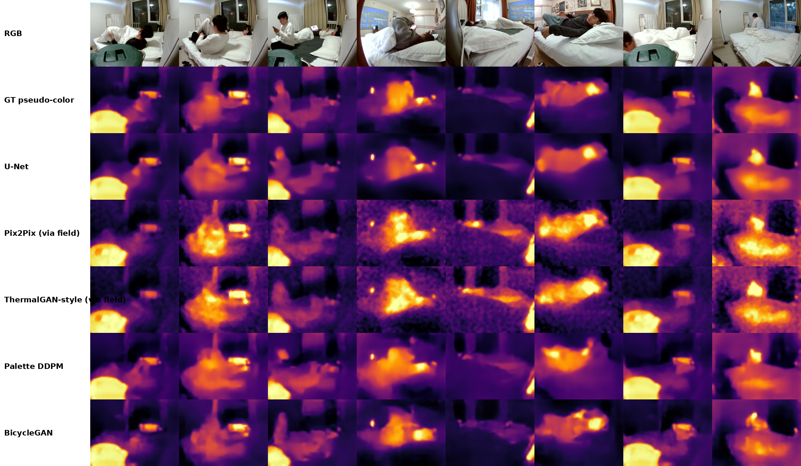
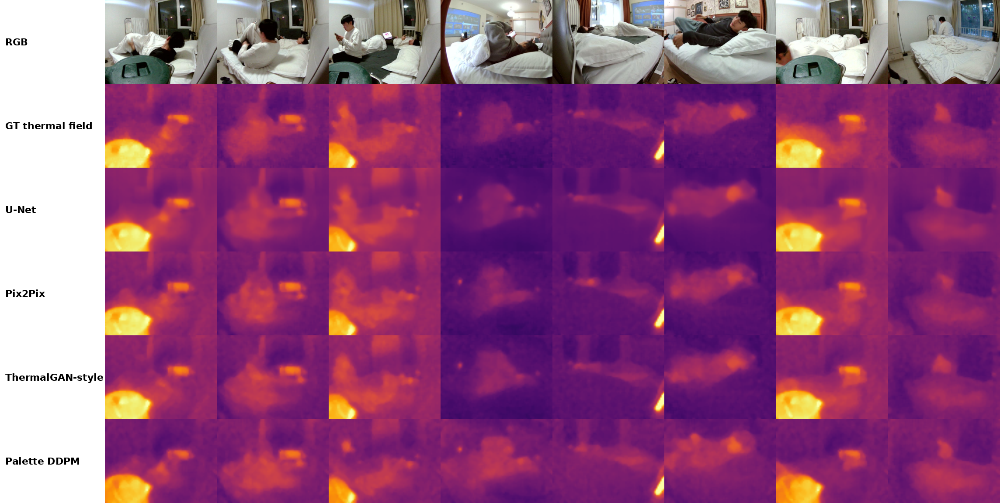
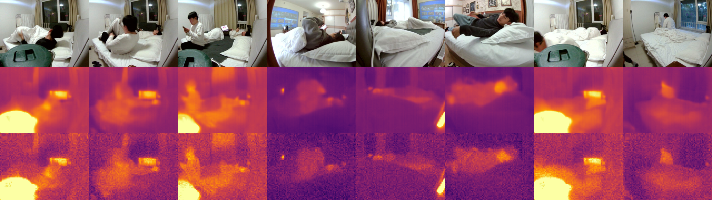
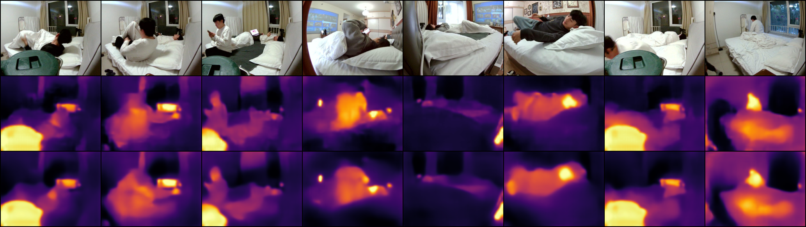
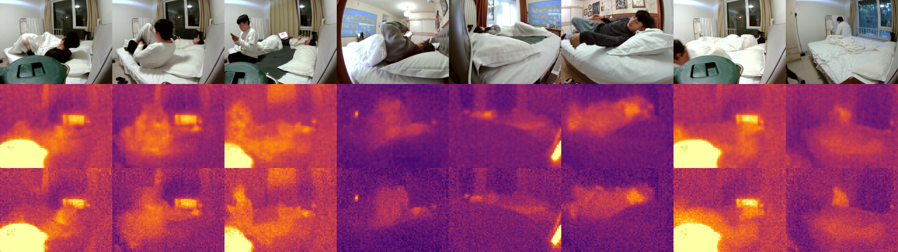
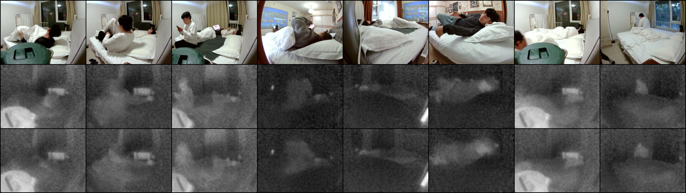
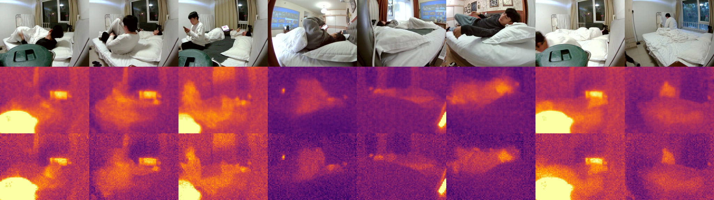
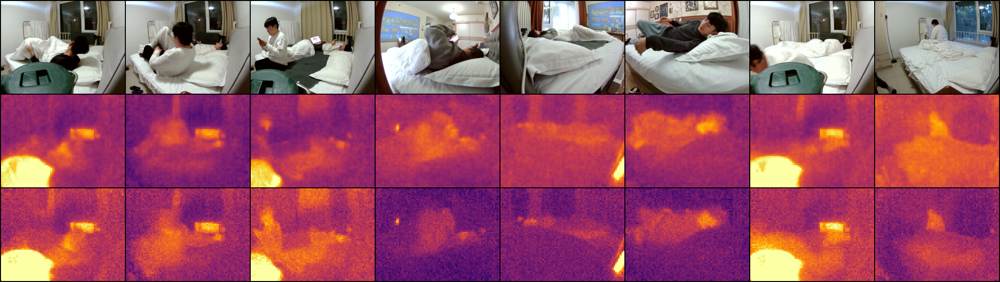
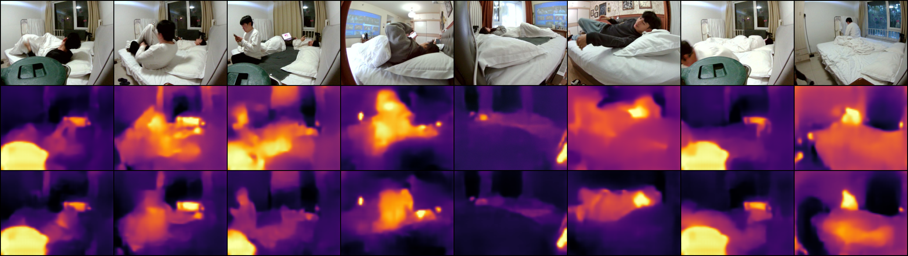
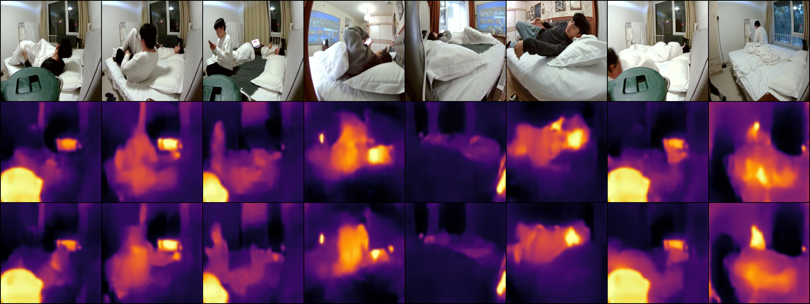

# RGB2T benchmark

RGB -> thermal-field / pseudo-color translation on `room04`-`room12`.
The paired manifest is generated by `prepare_dataset.py` and uses the same
80/20 frame-level split as IR2RGB (`seed=42`).

## Data

- `data/train.csv`: 30,019 pairs
- `data/test.csv`: 7,505 pairs
- `data/thermal_stats.npz`: per-pixel mean/std and global min/max temperature

Raw thermal `.bin` is read as `uint16`, skip 4 header bytes, reshaped to
`(62, 80)`, and divided by 10 to get Celsius.

## Baselines

| Method | Target | Command |
|---|---|---|
| U-Net | thermal field / pseudo-color | `train_unet.py` |
| Pix2Pix | thermal field / pseudo-color | `train_pix2pix.py` |
| ThermalGAN-style | relative thermal | `train_thermalgan.py` |
| Palette DDPM | thermal field / pseudo-color | `train_palette.py` |
| BicycleGAN | pseudo-color | official `third_party/BicycleGAN` |
| BBDM | pseudo-color | official `third_party/bbdm` (pending) |
| ThermalGen | RGB -> thermal (flow) | VAE checkpoint pending |

Training logs are in `runs/logs`.

## Metrics

All numbers are computed on the untouched `test.csv` split (7,505 frames).
Machine-readable JSON is in `results/metrics_*.json`.

- Thermal field: temperature MAE / RMSE / pooled R^2 in native Celsius on
  the `(62, 80)` field.
- Pseudo-color image quality: PSNR / SSIM / LPIPS. Direct methods are
  compared against the camera pseudo-color PNG; thermal-field methods are
  rendered with Inferno (`15-35 degC`) and compared against the same
  rendering of the ground-truth field.

A `-` marks a task a method does not support (ThermalGAN-style is a
thermal-field model, BicycleGAN is a 3-channel pseudo-color model).

> Status: Palette DDPM is evaluated from its current checkpoint (~92% of
> steps) with DDIM-100 sampling, so its row is preliminary. All other rows
> are final.

### Thermal field accuracy (global)

| Method | Temp MAE (degC) ↓ | Temp RMSE (degC) ↓ | R^2 ↑ |
|---|---:|---:|---:|
| U-Net | 0.654 | 0.860 | 0.923 |
| Pix2Pix | 0.753 | 1.000 | 0.896 |
| ThermalGAN-style | 0.726 | 0.957 | 0.905 |
| Palette DDPM | 2.236 | 2.892 | 0.134 |
| BicycleGAN | - | - | - |

### Pseudo-color image quality (global)

**Direct RGB synthesis** (compared to the camera pseudo-color PNG)

| Method | PSNR ↑ | SSIM ↑ | LPIPS ↓ |
|---|---:|---:|---:|
| U-Net | 23.379 | 0.861 | 0.104 |
| Pix2Pix | 8.761 | 0.038 | 0.630 |
| ThermalGAN-style | - | - | - |
| Palette DDPM | 14.683 | 0.624 | 0.316 |
| BicycleGAN | 20.343 | 0.780 | 0.182 |

> Pix2Pix direct pseudo-color collapsed to near-black output.

**Via thermal field** (render predicted field with Inferno)

| Method | PSNR ↑ | SSIM ↑ | LPIPS ↓ |
|---|---:|---:|---:|
| U-Net | 26.754 | 0.616 | 0.176 |
| Pix2Pix | 25.519 | 0.572 | 0.068 |
| ThermalGAN-style | 25.853 | 0.582 | 0.063 |
| Palette DDPM | 18.752 | 0.466 | 0.166 |
| BicycleGAN | - | - | - |

### Per-scene thermal field

**Temperature MAE (degC), lower is better**

| Scene | U-Net | Pix2Pix | ThermalGAN-style | Palette DDPM | BicycleGAN |
|---|---|---|---|---|---|
| room04 | 0.700 | 0.789 | 0.772 | 2.277 | - |
| room05 | 0.672 | 0.781 | 0.748 | 1.787 | - |
| room06 | 0.634 | 0.734 | 0.705 | 1.936 | - |
| room07 | 0.644 | 0.735 | 0.714 | 2.035 | - |
| room08 | 0.635 | 0.727 | 0.705 | 1.681 | - |
| room09 | 0.656 | 0.750 | 0.728 | 3.084 | - |
| room10 | 0.649 | 0.747 | 0.721 | 3.041 | - |
| room11 | 0.670 | 0.777 | 0.746 | 1.961 | - |
| room12 | 0.653 | 0.750 | 0.726 | 2.024 | - |

**Temperature RMSE (degC), lower is better**

| Scene | U-Net | Pix2Pix | ThermalGAN-style | Palette DDPM | BicycleGAN |
|---|---|---|---|---|---|
| room04 | 0.933 | 1.051 | 1.026 | 2.900 | - |
| room05 | 0.879 | 1.035 | 0.981 | 2.289 | - |
| room06 | 0.824 | 0.968 | 0.921 | 2.463 | - |
| room07 | 0.860 | 0.982 | 0.951 | 2.729 | - |
| room08 | 0.832 | 0.963 | 0.926 | 2.178 | - |
| room09 | 0.860 | 0.996 | 0.957 | 3.789 | - |
| room10 | 0.854 | 0.991 | 0.948 | 3.726 | - |
| room11 | 0.887 | 1.042 | 0.988 | 2.475 | - |
| room12 | 0.855 | 0.989 | 0.953 | 2.609 | - |

**R^2, higher is better**

| Scene | U-Net | Pix2Pix | ThermalGAN-style | Palette DDPM | BicycleGAN |
|---|---|---|---|---|---|
| room04 | 0.823 | 0.775 | 0.786 | -0.712 | - |
| room05 | 0.880 | 0.833 | 0.850 | 0.185 | - |
| room06 | 0.883 | 0.838 | 0.853 | -0.049 | - |
| room07 | 0.943 | 0.925 | 0.930 | 0.423 | - |
| room08 | 0.830 | 0.772 | 0.789 | -0.169 | - |
| room09 | 0.913 | 0.883 | 0.892 | -0.696 | - |
| room10 | 0.881 | 0.840 | 0.854 | -1.255 | - |
| room11 | 0.888 | 0.845 | 0.860 | 0.124 | - |
| room12 | 0.886 | 0.847 | 0.858 | -0.067 | - |

### Per-scene pseudo-color (direct)

**PSNR**

| Scene | U-Net | Pix2Pix | ThermalGAN-style | Palette DDPM | BicycleGAN |
|---|---|---|---|---|---|
| room04 | 21.580 | 9.389 | - | 12.713 | 19.382 |
| room05 | 22.312 | 7.907 | - | 14.391 | 19.740 |
| room06 | 22.943 | 8.743 | - | 14.595 | 20.115 |
| room07 | 26.064 | 8.846 | - | 16.400 | 22.712 |
| room08 | 22.965 | 7.354 | - | 15.177 | 20.685 |
| room09 | 23.855 | 10.666 | - | 14.256 | 20.784 |
| room10 | 23.267 | 9.868 | - | 13.897 | 19.471 |
| room11 | 22.632 | 7.795 | - | 14.807 | 19.541 |
| room12 | 23.501 | 8.033 | - | 14.656 | 20.054 |

**SSIM**

| Scene | U-Net | Pix2Pix | ThermalGAN-style | Palette DDPM | BicycleGAN |
|---|---|---|---|---|---|
| room04 | 0.835 | 0.052 | - | 0.550 | 0.771 |
| room05 | 0.843 | 0.031 | - | 0.618 | 0.764 |
| room06 | 0.860 | 0.035 | - | 0.633 | 0.790 |
| room07 | 0.897 | 0.042 | - | 0.679 | 0.827 |
| room08 | 0.873 | 0.014 | - | 0.685 | 0.797 |
| room09 | 0.861 | 0.057 | - | 0.581 | 0.784 |
| room10 | 0.847 | 0.054 | - | 0.562 | 0.753 |
| room11 | 0.854 | 0.032 | - | 0.632 | 0.759 |
| room12 | 0.869 | 0.023 | - | 0.647 | 0.778 |

## Pseudo-color comparison

Row 1 is the RGB input, row 2 is the GT pseudo-color, and the following
rows are each method's pseudo-color output (8 test frames).

## Thermal-field comparison

Row 1 is the RGB input, row 2 is the GT temperature field, and the following
rows are each method's predicted temperature field (Inferno, 15-40 degC).

## Example outputs

Each grid shows the visible RGB input, the predicted output, and the real thermal target.

### U-Net, thermal field

### U-Net, pseudo-color

### Pix2Pix, thermal field

### Pix2Pix, pseudo-color (via thermal field)

### ThermalGAN-style, relative thermal

### ThermalGAN-style, pseudo-color (via thermal field)

### Palette DDPM, thermal field

### Palette DDPM, pseudo-color

### BicycleGAN, pseudo-color

