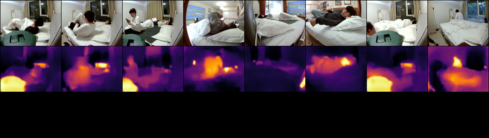

# RGB2T benchmark

RGB -> thermal-field / pseudo-color translation on `room04`-`room12`.
The paired manifest is generated by `prepare_dataset.py` and uses the same
80/20 frame-level split as IR2RGB (`seed=42`).

## Data

- `data/train.csv`: 30,019 pairs
- `data/test.csv`: 7,505 pairs
- `data/thermal_stats.npz`: per-pixel mean/std and global min/max temperature

Raw thermal `.bin` is read as `uint16`, skip 4 header bytes, reshaped to
`(62, 80)`, and divided by 10 to get Celsius.

## Baselines

| Method | Target | Command |
|---|---|---|
| U-Net | thermal field | `train_unet.py --target thermal` |
| U-Net | pseudo-color | `train_unet.py --target pseudo` |
| Pix2Pix | thermal field | `train_pix2pix.py --target thermal` |
| Pix2Pix | pseudo-color | `train_pix2pix.py --target pseudo` |
| Palette DDPM | thermal field / pseudo | `train_palette.py --target ...` |
| ThermalGAN-style | relative thermal | `train_thermalgan.py` |
| BicycleGAN | pseudo-color | official `third_party/BicycleGAN` |
| BBDM | pseudo-color | official `third_party/bbdm` |
| ThermalGen | pending | VAE checkpoint download blocked by Google Drive quota |

Training logs are in `runs/logs`.

## Completed baselines

The following four models finished 100 epochs and were evaluated on the
untouched `test.csv` split.

### Thermal field accuracy

| Method | Temp MAE (degC) | Temp RMSE (degC) | R^2 | PSNR | SSIM | LPIPS |
|---|---:|---:|---:|---:|---:|---:|
| U-Net | 0.654 | 0.847 | 0.744 | 26.754 | 0.616 | 0.176 |
| Pix2Pix | 0.753 | 0.981 | 0.655 | 25.519 | 0.572 | 0.068 |

### Pseudo-color synthesis

| Method | PSNR | SSIM | LPIPS |
|---|---:|---:|---:|
| U-Net | 23.379 | 0.861 | 0.104 |
| Pix2Pix | 8.761 | 0.038 | 0.630 |

Machine-readable metrics are in `results/metrics_*.json`. Sample grids are in
`samples/`.

## Example outputs

Each grid shows the visible RGB input, the predicted thermal field/pseudo-color,
and the real thermal target.

### U-Net, thermal field

### U-Net, pseudo-color

### Pix2Pix, thermal field

### Pix2Pix, pseudo-color

### ThermalGAN-style, relative thermal

