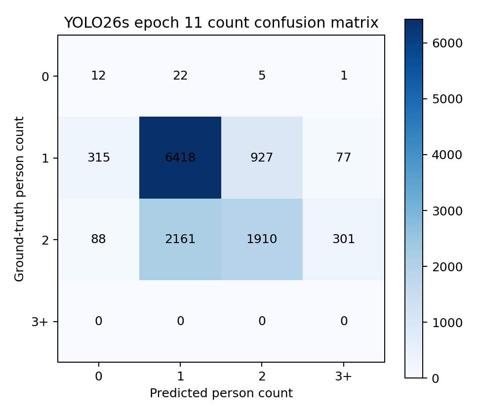

# Person counting from YOLO26s epoch-11 detections

This experiment estimates the number of people in each infrared frame by
counting YOLO26s epoch-11 detection boxes. It does not retrain or modify the
detector.

## Protocol

- Model: `early_training/yolo26s_epoch11/weights/model.pt`.
- Input: 80×62 infrared pseudo-color PNG, resized to 320×320.
- Validation rooms: 07, 13, and 20; 12,454 frames.
- Test rooms: 03, 10, and 18; 12,237 frames.
- The four person-state classes are mutually exclusive, so class-agnostic NMS
  is used to avoid counting overlapping state predictions twice.
- NMS IoU is 0.7. Candidate predictions are retained from confidence 0.01.
- The confidence threshold is selected on validation data only by minimum MAE;
  ties use exact-count accuracy, MSE, absolute bias, and then the higher
  threshold. The selected threshold is 0.210.
- The held-out test split is not used for threshold selection.

MAE and MSE are computed per frame from the predicted and annotated person
counts:

`MAE = mean(abs(predicted_count - ground_truth_count))`

`MSE = mean((predicted_count - ground_truth_count)^2)`

## Test results

| Method | MAE ↓ | MSE ↓ | RMSE ↓ | Exact-count accuracy ↑ | Mean error |
|---|---:|---:|---:|---:|---:|
| YOLO26s epoch 11, validation-selected `conf=0.210` | **0.3345** | 0.3685 | 0.6070 | **68.15%** | -0.0990 |
| YOLO26s epoch 11, standard `conf=0.250` | 0.3413 | 0.3739 | 0.6114 | 67.48% | -0.1776 |
| Validation-majority baseline: always predict one | 0.3677 | **0.3677** | **0.6064** | 63.23% | -0.3612 |

Relative to always predicting one person, the detector reduces MAE by 0.0333
(9.04% relative) and improves exact-count accuracy by 4.93 percentage points.
Its MSE is 0.0007 higher because a small number of errors exceed one person and
are penalized quadratically.

The selected-threshold model is within one person of the annotation on 98.49%
of test frames. Its mean error of -0.099 people per frame indicates a remaining
tendency to undercount.

## Results by annotated count

| Ground-truth count | Frames | MAE ↓ | MSE ↓ | Exact accuracy ↑ | Mean error |
|---:|---:|---:|---:|---:|---:|
| 0 | 40 | 0.8750 | 1.2750 | 30.00% | +0.8750 |
| 1 | 7,737 | **0.1817** | **0.2071** | **82.95%** | +0.1003 |
| 2 | 4,460 | 0.5946 | 0.6404 | 42.83% | -0.4534 |

The dominant failure is undercounting two-person frames. Of 4,460 such frames,
1,910 are counted correctly, while 2,161 are predicted as one person and 88 as
zero. The detector therefore predicts fewer than two people on 50.43% of the
two-person subset. This gap motivates the separate one-person versus two-person
image-classification baseline.

## Artifacts

- `metrics.json`: complete validation, test, baseline, per-count, and confusion
  metrics.
- `validation_threshold_sweep.csv`: all validation thresholds and selection
  metrics.
- `val_predictions.jsonl` and `test_predictions.jsonl`: per-frame ground-truth
  counts and raw detector boxes, states, and confidence scores.
- `count_confusion_matrix.png`: selected-threshold test confusion matrix.
