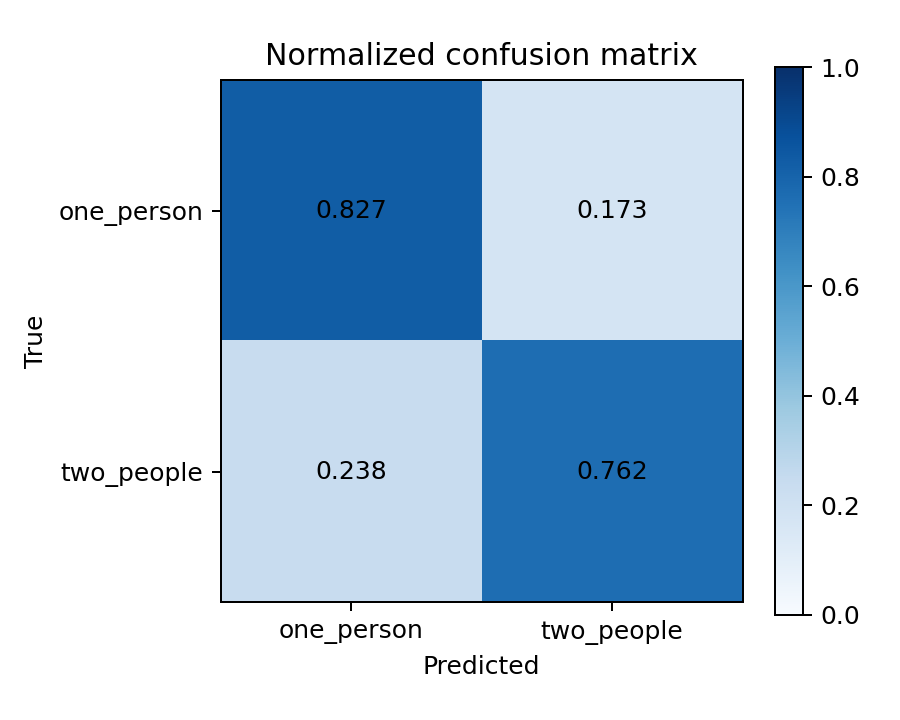

# One-person versus two-people ResNet baseline

This experiment treats person counting as direct image classification on the
infrared pseudo-color frames. A weighted ImageNet-pretrained ResNet18 predicts
either `one_person` or `two_people`; RGB frames are not used.

## Data protocol

The split is room-disjoint and uses the same rooms as the detector benchmark:

| Split | Rooms | One person | Two people | Total |
|---|---|---:|---:|---:|
| Train | 01, 02, 04, 05, 06, 08, 09, 11, 12, 14, 15, 16, 17, 19 | 39,595 | 19,109 | 58,704 |
| Validation | 07, 13, 20 | 7,952 | 4,330 | 12,282 |
| Test | 03, 10, 18 | 7,678 | 4,463 | 12,141 |

Frames marked as high-noise, frames with conflicting labels, and count classes
0 and 3 are excluded. The complete inclusion and exclusion counts are in
[`dataset/manifest.json`](dataset/manifest.json).

## Training

- Architecture: ImageNet-pretrained ResNet18 with a two-class output layer.
- Input: 80 x 62 infrared pseudo-color PNG, aspect-ratio padded to 224 x 224.
- Loss: weighted cross-entropy; training weights are 0.7413 for one person and
  1.5360 for two people.
- Optimizer: AdamW, learning rate 3e-4, weight decay 1e-4, cosine schedule.
- Augmentation: horizontal flip, translation up to 5%, and scale 0.9-1.1.
- Batch size: 1,024 on one NVIDIA L40S.
- Selection: maximum validation macro F1. The best checkpoint is epoch 7;
  training stopped at epoch 13 after six non-improving epochs.

The run is reproducible with:

```bash
CUDA_VISIBLE_DEVICES=0 python person_count/train.py \
  --output person_count/runs/resnet18_weighted \
  --epochs 30 --batch-size 1024 --workers 16 --device cuda:0 --cache

CUDA_VISIBLE_DEVICES=0 python person_count/evaluate.py \
  --checkpoint person_count/runs/resnet18_weighted/best.pt \
  --batch-size 1024 --workers 16 --device cuda:0 --cache
```

## Held-out test result

| Model | MAE down | MSE down | RMSE down | Exact count accuracy up | Balanced accuracy up | Macro F1 up | Mean error |
|---|---:|---:|---:|---:|---:|---:|---:|
| ResNet18 direct classification | **0.1968** | **0.1968** | **0.4436** | **80.32%** | **79.47%** | **79.09%** | +0.0222 |

Because this is a binary 1-versus-2 task, every wrong prediction is off by
exactly one person. Consequently, MAE and MSE both equal the error rate.

| Ground truth | Frames | Precision | Recall / exact count accuracy | F1 |
|---|---:|---:|---:|---:|
| One person | 7,678 | 85.69% | 82.69% | 84.17% |
| Two people | 4,463 | 71.91% | 76.25% | 74.02% |

The confusion matrix (rows are ground truth and columns are prediction) is:

```text
                 predicted 1   predicted 2
ground-truth 1         6349          1329
ground-truth 2         1060          3403
```



## Fair comparison with YOLO26s epoch 11

For a like-for-like comparison, YOLO box counts were rescored on these exact
12,141 test frames using the classification CSV labels as ground truth. Its
confidence threshold, 0.191, was chosen only on the matching validation split
by minimum MAE. Class-agnostic NMS with IoU 0.7 was used so overlapping
person-state classes are not counted twice.

| Method | Input | MAE down | MSE down | RMSE down | Exact count accuracy up | Mean error |
|---|---:|---:|---:|---:|---:|---:|
| ResNet18 direct classification | 224 | **0.1968** | **0.1968** | **0.4436** | **80.32%** | +0.0222 |
| YOLO26s epoch 11 box count, validation-selected confidence | 320 | 0.3364 | 0.3743 | 0.6118 | 68.17% | -0.0651 |

Relative to YOLO box counting, ResNet18 reduces MAE by **41.50%**, MSE by
**47.43%**, and RMSE by **27.49%**, while improving exact count accuracy by
**12.16 percentage points**.

| Ground truth | ResNet18 exact accuracy | YOLO26s exact accuracy | ResNet advantage |
|---|---:|---:|---:|
| One person | 82.69% | 82.00% | +0.69 points |
| Two people | **76.25%** | 44.36% | **+31.88 points** |

The main difference is the two-person subset. YOLO predicts exactly two boxes
for only 1,980 of 4,463 two-person frames and undercounts 2,121 of them. The
classifier gets 3,403 of those frames right. This supports the hypothesis that
the full-frame appearance contains useful count information even when the two
people cannot be separated into two reliable boxes.

This comparison is intentionally limited to the 1/2-person task. YOLO can in
principle output 0, 3, or more people, while this ResNet classifier cannot; the
ResNet result should therefore not be interpreted as a general-purpose person
counter outside these two classes.

## Batch-one speed

Both benchmarks use preloaded 80 x 62 frames on the same NVIDIA L40S and
exclude disk I/O:

| Method | Mean latency | Throughput |
|---|---:|---:|
| ResNet18 | **2.992 ms** | **334.2 FPS** |
| YOLO26s epoch 11 | 5.828 ms | 171.6 FPS |

ResNet18 has 48.66% lower measured latency and 1.95x the throughput. The
software paths are not identical: the ResNet timing includes its letterbox,
transfer, forward pass, and softmax, while the YOLO timing uses the Ultralytics
array prediction pipeline, forward pass, and postprocessing.

## Artifacts

- [`results/metrics.json`](results/metrics.json): complete ResNet test metrics.
- [`results/yolo26s_epoch11_metrics.json`](results/yolo26s_epoch11_metrics.json):
  fair-split YOLO validation threshold selection and test metrics.
- [`results/benchmark.json`](results/benchmark.json): ResNet batch-one speed.
- [`results/confusion_matrix.png`](results/confusion_matrix.png),
  [`results/confusion_matrix_normalized.png`](results/confusion_matrix_normalized.png),
  and [`results/roc_curve.png`](results/roc_curve.png): ResNet plots.
- [`results/yolo26s_epoch11_confusion_matrix.png`](results/yolo26s_epoch11_confusion_matrix.png):
  fair-split YOLO count confusion matrix.
- `runs/resnet18_weighted/best.pt`: local best checkpoint (ignored by Git).
- `runs/resnet18_weighted/history.csv` and `training_curves.png`: local training
  history (ignored by Git).
